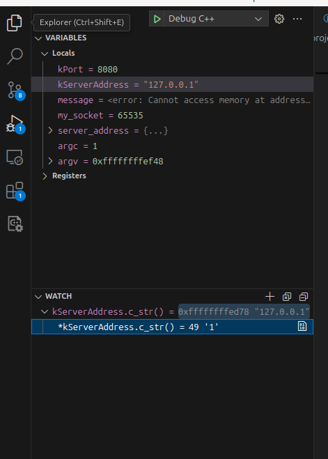
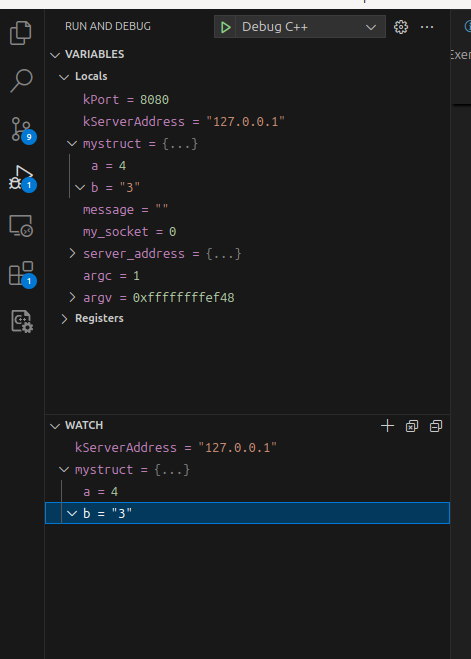

# Exercise 2

**Update this README with your answers to the questions below.**

## Sources of Information for Questions from Before

### Socket 
- https://man7.org/linux/man-pages/man2/socket.2.html - System call reference
  for creating communication endpoints
- Or type `man socket` in terminal
- https://man7.org/linux/man-pages/man7/socket.7.html - Socket interface 
  overview and protocol families
- Or type `man 7 socket` in terminal
- When would you want to use a `SOCK_RAW` stream?
  - used for direct sneding and receiving of IP packets without the involvement of any transport layer packet handling.

### TCP and IP Protocols
- [IPv4](https://www.rfc-editor.org/info/rfc791) - Internet Protocol 
  specification defining packet structure and routing
- [IPv6](https://www.rfc-editor.org/info/rfc8200) - Next-generation Internet 
  Protocol with expanded address space
- [TCP](https://datatracker.ietf.org/doc/html/rfc9293) - Transmission Control 
  Protocol providing reliable, ordered data delivery
    
### C++
- [C++23 ISO standard draft](https://www.open-std.org/jtc1/sc22/wg21/docs/papers/2023/n4950.pdf) - 
  Working draft of the C++ language specification
- Is the above the official C++23 spec? 
  - Yes, it is in the terms that it is the final working draft published by the committee, but not the official ISO-published standard.
- Where is the official C++23 spec?
  - https://www.iso.org/standard/83626.html
- Why was this link chosen instead?
  - Because the official documentation is not available offline, and the link of draft is easily accessible free of cost.
- Is this a helpful reference for learning C++?
  - Yes, indeed.
- Can the various implementations of C++ compilers be different from the
  C++ standard?
  - Yes, they can but ideally they should not. They can differ because compilers may not yet support all the latest features from latest standard (like C++23 or C++26), or in other words there might be a lag. Some compilers may provide extensions that are not the part of standard.
- What are the most widely used and most significant C++ compilers?
  - GCC(GNU Compiler Collection)
  - Clang/LLVM
  - MSVC (Microsoft Visual CPP)
  - Intel C++ Compiler (ICC)
- Where is the equivalent spec for C++26?
  - It is still under development and is expected to release in 2026.
  - The current developments can be found here: https://www.open-std.org/jtc1/sc22/wg21/docs/papers/

- Where do you find the spec for the HTTP protocol?
  - RFC 2616 for HTTP/1.1: https://datatracker.ietf.org/doc/html/rfc2616
  - RFC 9113 for HTTP/2.0: https://datatracker.ietf.org/doc/html/rfc9113
- What about HTTPS? Is there a spec for that protocol?
  - HTTPS is not a separate protocol, it is just HTTP over TLS (Transport Layer Security).
  - The spec involves 2 parts: HTTP + TLS
  - TLS Specification: https://datatracker.ietf.org/doc/html/rfc8446
## Introduction to C++ and Sockets Programming

- Read the code in `src/`
- Are there any bugs in this code? 
  - Nope, i didn't find any.
- What can you do to identify if there are bugs in the code?
  - Compile the code and execute it  to test it. Make various test cases too.

## Refactoring: Extract Function

- What is different in this code compared to exercise-1?
  - This code is much more modular and easier to read.
- Is this code better or worse than exercise-1?
  - Definitely better.
- What are the tradeoffs compared to exercise-1?
  - Increases the code length a bit.
- Are you able to spot any mistakes or inconsistencies in the changes?
  - Not anything that I can find.
  
## Thinking About Performance

- Does writing code this way have any impact on performance?
  - Nope, there is no significant impact, creating separate functions does have a small overhead of calling functions but in modern C++ with optimizations that overhead is almost negligible.
- What do we mean when we say performance?
  - We refer to the speed of program (latency), resource usage (cpu and memory) etc.
- How do we measure performance in a program?
  - Use timing methods like chrono library, or profiling tools like perf, gprof (to see the time taken by each part of code), valgrind (to know the memory usage), testing tools etc.

## Play with Git

- There isn't necessarily a single correct answer for how to abstract the 
  code from exercise-1 into functions
- Try different ways to refactor the code from exercise-1 to make it more
  readable.
- Make sure to commit each change as small and self-contained commit
- This will make it easier to revert your code if you need to
- What is `git tag`? How is `git tag` different from `git branch`?
  - git tag is like a fixed pointer that points to a specific commit. It is different from branches as: 
  git branch is like a movable pointer to a series of commits. Each time we add a commit the pointer mover forward, whereas the tag is a fixed pointer. It is fixed to a commit.
- How can you use `git tag` and `git branch` to make programming easier and
  more fun?
  - We should use branches to isolate work in order to develop features, whereas tags to keep track of stable release versions. It would also help us to visit older versions without risk.

## Learn Basics of Debugging in Your IDE

- How do you enable debug mode in your IDE?
  - In VS Code, we can directly click on Debug and Run command on top right corner. Or select Debug option from Run dropdown.
- In debug mode, how do you add a watch?
  - Go to the watch panel on debug sidebar, click +, add variable that you want to watch.
  - Or directly right click on a variable in locals in the variable pane, and just click on watch.
- In debug mode, how do you add a breakpoint?
  - click the left margin where you want to put the breakpoint. It appears as a red circle.
- In debug mode, how do you step through code?
  - f10: step over, f11: step into, f5: continue;

### Memory Management and Debug Mode in Your IDE

- How do you see the memory layout of a `std::string` from your IDE debug mode?
  - By first stopping the execution in midst, while the string is still in scope and then watching it.

- How do you see the memory layout of a struct from your IDE debug mode?
  - It is almost similar way.
  
  - Configuring Debug mode on Remote server is required.