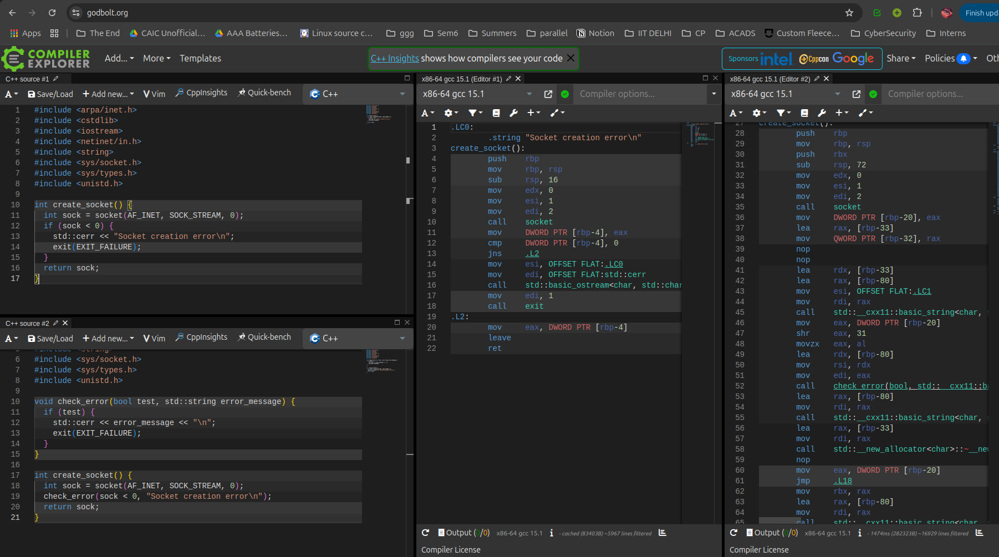

# Exercise 3

**Update this README with your answers to the questions below.**

## Re-using Code

- Read the code in `src/tcp_echo_client.cc`
- A new function `check_error()` has been created and `create_socket()` from 
  exercise-2 has been refactored to make use of it
- What are the benefits of writing code in this way?
  - Introduces modularity and code reusability. Allows easier debugging of the code.
- Are there any costs to writing code like this?
  - nope, no significant costs
- Apply `check_error` to all the code in `src/`
  - alright done.

## Introduction to Compiler Explorer

- Try out the old `create_socket()` and the new `check_error()` and 
  `create_socket()` in [Compiler Explorer](https://godbolt.org) - Interactive tool for exploring how C++ code compiles to assembly
  - 
- What is happening here?
  - The compiled code with check_error() function is much larger than the simpler compiled code.
- Can you think of any different approaches to this problem?
  - With inline error-checking logic, the compiler optimizes it very aggressively, whereas in newer version, check_error() function is taking an std::string object as an input which is a very heavy weight c++ object. It involves construction and destruction of a very heavy weight literal.
  - Alternative approach: Use macros.
  #define CHECK_ERROR(cond, msg) \
  do { if (cond) { std::cerr << msg << "\n"; exit(EXIT_FAILURE); } } while (0)
  This replaces the macro in the preprocessor stages.
  - Or we may use char* instead of string. That will also reduce the size of compiled code.
- How can you modify your Makefile to generate assembly code instead of compiled code?
  - use -S flag for generating assembly code, -o filename.s

- **Note**: You can save the generated assembly from Compiler Explorer
- **Bonus**: Can you view assembly code using your IDE?
  - Yes definitely, why not?
- **Bonus**: How do you see the assembly when you step through each line in debugging mode from your IDE?
  - Using the disassembly view. Right click on source code -> open disassembly view.
- [x86 assembly reference](http://ref.x86asm.net/) - Comprehensive reference 
  for x86 assembly language instructions and syntax

## More About Memory Management

- Make sure you have `-fsanitize=address` in both your `CXX_FLAGS` and 
  `LD_FLAGS` in your Makefile. Done.
- What do `-fsanitize=address`, `CXX_FLAGS` and `LD_FLAGS` mean?
  - `-fsanitize=address` enables address senitizer. 
  The address senitizer detects errors like use after free, buffer overflows, stack and heap memory errors.
  CXX_FLAGS are used as compiler flags that are passed to g++ during compilation.
  LD_FLAGS are linker flags that are passed during linking.
- With the new tool of the Compiler Explorer, and keeping in mind what you have learned about how to use debug mode
- What happens when you look at a `std::string` using the above methods?
  - std::string appears as a complex object, not just a plain buffer, with pointer to heap data along with size and capacity fields.
- Where is the text in your `std::string`?
  - short strings are stored inside object SSO, Longer are stored in the heap.
- What is `std::optional`?
- How do you find out the memory layout of a `std::optional`?
- Read https://en.cppreference.com/w/cpp/memory#Smart_pointers - Guide to 
  modern C++ memory management using smart pointers
- Which pointer types are the most important to know about?
- Which smart pointer should you use by default if you can?
- Does changing your optimization level in `CXXFLAGS` from `-O0` to `-O3` have any impact on the answers to any of the above questions?

## More Thinking About Performance

- After your experiments with Compiler Explorer, do you have any updates for
  your answers in exercise-2?

### Bonus: Do Not Watch Now 

- [More about Compiler Explorer](https://www.youtube.com/watch?v=bSkpMdDe4g4) - 
  Deep dive into compiler optimization and assembly analysis
  - Create a struct which contain many different data types
  - Look at the memory layout in the debugger
  - Create a `char` or `uint8_t` pointer to the beginning of the struct, 
    iterate to the end of the struct, printing out the value of each byte in 
    hexadecimal
  - Try accessing different parts of the struct and see in compiler explorer
    what the assembly looks like
  - What happens if you iterate the pointer to outside the bounds of your
    array?
  - Let's say your struct is called `Foo`
  - What is the difference between `std::vector<Foo>` and `std::vector<Foo*>`?
  - What are the tradeoffs between using `std::vector<Foo>` vs 
    `std::vector<Foo*>`? 
  - Give an example where `std::vector<Foo>` is a better choice than 
    `std::vector<Foo*>`
  - Give another example where the opposite is true
  - Can you create `std::vector<Foo&>`? 
  - Can you create `std::vector<std::optional<Foo>>`?
  - What happens if your struct contains another struct?
  - What is the difference between a struct and a class?